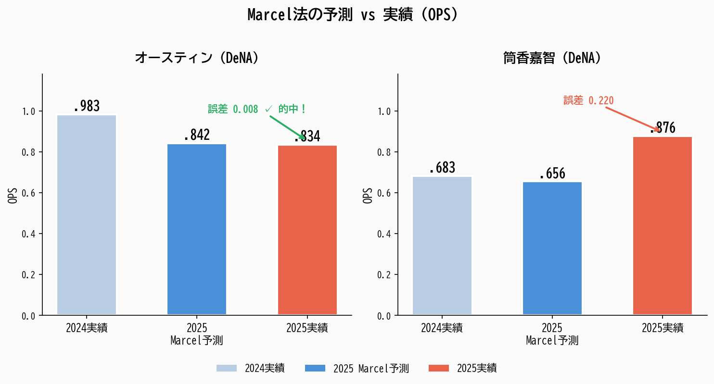

# 1980年代の予測法がAIに勝った話 — プロ野球選手の来年の成績を予測してみた

「来年、牧秀悟は打率どのくらいだろう？」
「村上宗隆はホームラン何本打つだろう？」

こんな疑問に、データで答えるシステムを作ってみました。

> **この記事に出てくる用語**
> - **OPS** — 出塁率＋長打率。打者の総合力を測る指標。.700台が平均的、.900超えは一流
> - **ERA（防御率）** — 投手が9イニングあたりに取られる自責点。小さいほど優秀。2点台ならエース級
> - **PA（打席数）** — バッターボックスに立った回数。四球や死球も含む
> - **MAE（平均絶対誤差）** — 予測がどれくらいズレたかの平均。小さいほど正確
> - **wOBA** — 打者の1打席あたりの得点貢献を測る指標。打率より正確に実力がわかる
> - **wRC+** — wOBAをリーグ平均=100に換算したもの。150なら「平均の1.5倍の得点力」

---

## やったこと（ざっくり）

プロ野球12球団、2015年〜2025年の全選手の成績データを集めて、「来年の成績」を2つの方法で予測しました。

**方法1: Marcel法（マルセル法）**
→ 過去3年の成績を「最近のほうを重め」に平均する、シンプルな方法。1980年代にTom Tangoという人が考案。

**方法2: AI（LightGBM）**
→ 機械学習。データのパターンを自動で学習して予測する、いわゆる「AI」。

---

## 結果：Marcel法がAIに勝った（2年分のデータで検証）

2024年と2025年、2年分の実績と比較しました。

### 2024年検証

| 方法 | 打者の精度（OPS） | 投手の精度（ERA） |
|---|---|---|
| **Marcel法** | **誤差 .055** | **誤差 0.62** |
| AI（LightGBM） | 誤差 .077 | 誤差 0.95 |

### 2025年検証

| 方法 | 打者の精度（OPS） | 投手の精度（ERA） |
|---|---|---|
| **Marcel法** | **誤差 .048** | **誤差 0.63** |
| AI（XGBoost） | 誤差 .062 | 誤差 0.92 |

※ 数字が小さいほど正確

**2年連続で、1980年代のシンプルな方法が最新のAIに勝ちました。**

これは実は野球データ分析の世界ではよく知られた事実です。でも「自分で2年分のデータで確かめた」というのが大事なところです。

---

## なぜシンプルな方法が勝つのか

理由はこうです。

**選手の実力は、1〜2年ではそんなに変わらない。**

だから「去年と一昨年と3年前の平均」がそのまま来年の予測として優秀なんです。

一方AIは、データの中の「たまたまのパターン」まで覚えてしまう（これを「過学習」と言います）。プロ野球は12球団しかなく、年によってデータの数が限られるので、AIが力を発揮しにくい環境なんです。

---

## Marcel法って具体的にどう計算するの？

3ステップだけです。

**ステップ1: 過去3年を混ぜる**

去年の成績を「5」、2年前を「4」、3年前を「3」の重みで平均します。
直近の調子をより反映するという考え方。

**ステップ2: 平均に引き戻す**

試合にあまり出ていない選手は、データが少ないので信頼度が低い。そういう選手の予測は「リーグ全体の平均」に近づけます。

**ステップ3: 年齢で調整する**

野球選手は一般的に27歳前後がピーク。若い選手は少し上方修正、ベテランは少し下方修正します。

---

## 予測が当たった選手、外れた選手

数字だけだとピンとこないので、具体的な選手で見てみます。



### オースティン（DeNA）— 誤差わずか .008

2024年にOPS .983という圧倒的な成績を残したオースティン選手。Marcel法が2025年を予測した結果：

- Marcel予測: OPS .842
- 2025年実績: OPS .834
- **誤差: .008**

ケガで出場機会が限られる傾向をふまえて控えめに予測したことが、結果的に的確でした。

### 筒香嘉智（DeNA）— 復活は予測できなかった

MLB挑戦から戻った2024年はOPS .683と苦しんだ筒香選手。Marcel法の予測は：

- Marcel予測: OPS .656
- 2025年実績: OPS .876（20本塁打）
- **誤差: .220**

2024年の不振に引っ張られ、低めに予測してしまいました。しかし2025年の筒香選手は見事に復活。こういう「コンディション回復による大幅な成績向上」は、Marcel法の弱点と考えられます。

**予測の限界を知ることも、予測モデルを使う上で大切なことです。**

---

## もう一つの発見：wOBA/wRC+を自分で計算した

MLB（メジャーリーグ）には「wOBA」「wRC+」という、打者の本当の得点貢献を測る指標があります。

でもNPB（日本プロ野球）では公式に計算されていません。

そこで、NPBの公式データから自分で計算しました。

### 2024年の「本当の得点力」ランキング（wRC+）

| 選手 | wRC+ | 意味 |
|---|---|---|
| 近藤健介 | 249 | リーグ平均の**2.5倍**の得点力 |
| オースティン | 248 | 同上 |
| サンタナ | 220 | リーグ平均の**2.2倍** |

wRC+ 100がリーグ平均です。近藤健介の249は「平均の2.5倍の価値がある打者」ということ。打率だけでは見えないものが見えてきます。

---

## チームの強さも予測できる

「得点が多くて失点が少ないチームが勝つ」 — 当たり前のことですが、これを数式にしたのが**ピタゴラス勝率**です。

MLBでは長年使われている指標で、NPBに最適化したところ、**1シーズンあたり平均3.2勝の誤差**で予測できました。

---

## APIも作った

これらの予測をWebブラウザから試せるようにもしました（FastAPIというフレームワークを使用）。

例えば「牧秀悟の翌年予測は？」と聞くと：

```
OPS: .834（Marcel法の予測）
打率: .295
ホームラン: 22.9本
打点: 81.4
```

こんな感じで返ってきます。

---

## まとめ

- プロ野球の過去10年分の成績データで、来年の予測システムを作った
- 2年分の検証で、1980年代のMarcel法が最新のAI（LightGBM/XGBoost）より一貫して正確だった
- オースティンのように誤差 .008で的中するケースもあれば、筒香の復活のように予測が追いつかないケースもある
- NPBにはない「wOBA/wRC+」を自分で計算した
- チームの勝率もデータから予測できた

**「最新技術が常に最善とは限らない」** ということを、自分の手で確かめた体験でした。予測の強みと限界を両方理解して使うことが大切だと感じています。

→ **GitHub**: https://github.com/yasumorishima/npb-prediction

データの提供元：[プロ野球データFreak](https://baseball-data.com) / [NPB公式サイト](https://npb.jp)
